<p align="center">
  
  
  
</p>

<h1 align="center">🚀 Career Co-Pilot</h1>

<p align="center">
  <strong>An AI-Powered Career Intelligence & Application Optimization System</strong><br/>
  <em>Maximize interview conversions — not application volume.</em>
</p>

<p align="center">
  
  
  
  
  
  
  
  
  
  
</p>

---

## 📖 Table of Contents

- [🎯 The Problem](#-the-problem)
- [💡 Our Solution](#-our-solution)
- [✨ Key Features](#-key-features)
- [🏗️ System Architecture](#️-system-architecture)
- [🧠 AI & Intelligence Pipeline](#-ai--intelligence-pipeline)
- [🖥️ Tech Stack](#️-tech-stack)
- [📦 Monorepo Structure](#-monorepo-structure)
- [🚀 Getting Started](#-getting-started)
- [🐳 Docker Deployment](#-docker-deployment)
- [🌐 Visible Browser Setup](#-visible-browser-setup)
- [🔌 API Reference](#-api-reference)
- [🛡️ Security & Compliance](#️-security--compliance)
- [🗺️ Roadmap](#️-roadmap)
- [👥 Team — Career Savers](#-team--career-savers)
- [📄 License](#-license)

---

## 🎯 The Problem

Job hunting is broken. Students and early-career professionals face:

| Pain Point | Impact |
|---|---|
| 🔄 **Spray-and-pray applications** | 300+ applications with < 5% response rates |
| 📄 **Generic resumes** | One-size-fits-all resumes that ATS systems filter out |
| 🕵️ **Scattered job sources** | Hours wasted manually searching across dozens of platforms |
| 🤖 **Spam auto-apply bots** | Mass applications that get accounts flagged and banned |
| 📊 **Zero feedback loops** | No way to learn what's working and what isn't |

> **The goal is not to apply to 300 jobs.**
> **The goal is to maximize interview callbacks per 10 applications.**

---

## 💡 Our Solution

**Career Co-Pilot** is a **local-first, AI-powered career intelligence system** that transforms how you search, apply, and prepare for jobs. Instead of automating volume, we optimize for quality.

```
  Prepare  →  Review  →  Approve  →  Submit
     ↑                                  │
     └──── Feedback Learning Loop ──────┘
```

### What makes us different?

| Feature | Spam Bots | Career Co-Pilot |
|---|---|---|
| **Application control** | Mass unattended | User approves each one |
| **Resume generation** | Generic template | AI-tailored per job description |
| **Submission** | Invisible, headless | Visible browser — you see every click |
| **Data privacy** | Cloud-scraped | 100% local-first |
| **Intelligence** | None | Learns from your outcomes over time |
| **Interview prep** | ❌ | Auto-generated kits per role |
| **Compliance** | ⚠️ Risky | Ethical, rate-limited, user-controlled |

---

## ✨ Key Features

### 📋 Career Profile Engine
Build a structured career knowledge graph from your skills, projects, experience, and certifications. The system infers skill relationships (e.g., *REST APIs → HTTP knowledge*), calculates confidence scores, and dynamically clusters your abilities.

### 🔍 Hybrid Job Discovery Engine
Intelligently discovers jobs from safe, permissible sources using **recursive intent expansion** — not blind crawling. Generates smart search queries from your profile, deduplicates results with hash + semantic similarity matching, and ranks every opportunity.

### 📊 Intelligent Job Ranking
Every discovered job receives a composite **Interview Probability Score** based on:
- Skill match score
- Experience alignment
- Role depth analysis
- Skill gap penalty
- Seniority compatibility

### 📝 AI Resume Generation (Gemini-Powered)
A full pipeline that parses job descriptions, selects the most relevant fragments from your profile, rewrites bullets contextually with **strict anti-hallucination guardrails**, optimizes for ATS keyword density, and produces a tailored resume — with explainability for every included bullet.

### 📨 Application Draft Engine
Prepares complete application packages — tailored resume, cover letter, and pre-filled screening question answers — without ever submitting. Everything stays in **draft** until you explicitly approve.

### 🖥️ Controlled Submission Engine
After your approval, a **visible browser session** opens and fills out the application form in real-time. You watch every field get filled. A **double-approval** flow means you see the completed form before the final submit click. Safety features include daily submission caps, human-like timing delays, and zero unattended submissions.

### 🎯 Interview Preparation Engine
Automatically generates targeted interview kits when an application moves to the interview stage:
- Technical questions calibrated to the job description
- Behavioral prompts with STAR-format answer drafts
- Company-specific deep-dive questions
- Weakness-targeting questions based on your skill gaps
- Difficulty scaling across Easy → Medium → Hard

### 📈 Feedback Learning Loop
The system learns from your outcomes — tracking approved/rejected applications, interview callbacks, and offer rates — to continuously adapt ranking weights, resume tone, role priorities, and skill importance. Cold-start guards ensure no unreliable patterns surface before sufficient data.

### 📊 Insights & Analytics Dashboard
Real-time metrics with interactive Recharts visualizations:
- Application volume over time
- Response rate & interview rate trends
- Match distribution breakdowns
- Best-performing resume versions
- Top missing skills across rejections

---

## 🏗️ System Architecture

```
┌─────────────────────────────────────────────────────────────┐
│                     Desktop UI (React + Vite)               │
│  ┌─────────┐ ┌────────────┐ ┌──────────┐ ┌──────────────┐  │
│  │  Jobs    │ │Applications│ │  Resume  │ │  Interviews  │  │
│  │ Library  │ │  Kanban    │ │  Studio  │ │  Prep Kit    │  │
│  └─────────┘ └────────────┘ └──────────┘ └──────────────┘  │
│  ┌─────────┐ ┌────────────┐ ┌──────────┐                   │
│  │ Profile  │ │  Insights  │ │ Settings │                   │
│  │ Editor   │ │ Dashboard  │ │   Page   │                   │
│  └─────────┘ └────────────┘ └──────────┘                   │
└──────────────────────┬──────────────────────────────────────┘
                       │  REST API
┌──────────────────────▼──────────────────────────────────────┐
│               Local Backend (FastAPI + Python)              │
│  ┌──────────────────────────────────────────────────────┐   │
│  │                  AI Engine Layer                      │   │
│  │  ┌─────────┐ ┌────────┐ ┌──────────┐ ┌───────────┐  │   │
│  │  │Discovery│ │ Resume │ │ Draft &  │ │ Interview │  │   │
│  │  │ Engine  │ │ Engine │ │Submission│ │  Engine   │  │   │
│  │  └─────────┘ └────────┘ └──────────┘ └───────────┘  │   │
│  │  ┌─────────┐ ┌────────┐                              │   │
│  │  │Feedback │ │Profile │                              │   │
│  │  │ Loop    │ │ Engine │                              │   │
│  │  └─────────┘ └────────┘                              │   │
│  └──────────────────────────────────────────────────────┘   │
│  ┌────────────┐  ┌─────────────┐  ┌────────────────────┐   │
│  │ Gemini AI  │  │  Playwright │  │   APScheduler /    │   │
│  │  Client    │  │  Browser CDP│  │   Async Scheduler  │   │
│  └────────────┘  └─────────────┘  └────────────────────┘   │
└──────────────────────┬──────────────────────────────────────┘
                       │
┌──────────────────────▼──────────────────────────────────────┐
│                Local Storage Layer                          │
│  ┌────────────────────────────────────────────────────────┐ │
│  │                    SQLite Database                     │ │
│  │  user_profile │ jobs │ resume_versions │ app_drafts   │ │
│  │  interview_kits │ insights_cache │ discovery_runs     │ │
│  └────────────────────────────────────────────────────────┘ │
└─────────────────────────────────────────────────────────────┘
```

---

## 🧠 AI & Intelligence Pipeline

```mermaid
graph LR
    A[User Profile] --> B[Role Inference Engine]
    B --> C[Query Generator]
    C --> D[Job Discovery<br/>Remotive API / RSS]
    D --> E[Normalizer + Dedup]
    E --> F[Ranking Engine]
    F --> G[Job Library UI]

    G --> H[Resume Engine]
    H --> H1[JD Analyzer]
    H1 --> H2[Fragment Selector]
    H2 --> H3[Bullet Rewriter<br/>Gemini AI]
    H3 --> H4[Resume Compiler]

    H4 --> I[Draft Engine]
    I --> I1[Form Analyzer<br/>Playwright]
    I1 --> I2[Draft Generator]
    I2 --> J[Review Dashboard]

    J -->|Approve| K[Submission Engine<br/>Visible Browser]
    K --> L[Outcome Tracking]
    L --> M[Feedback Loop]
    M --> N[Weight Adapter]
    N -->|Improved Rankings| F

    J -->|Interview| O[Interview Kit<br/>Generator]
    O --> P[Mock Simulator]
```



### Anti-Hallucination Guardrails

Our AI resume generation follows strict rules to ensure **zero fabricated claims**:

- ✅ Preserve ALL factual claims exactly as written
- ✅ Never add metrics, numbers, or technologies not in the original
- ✅ Graceful fallback to rule-based output when Gemini is unavailable
- ✅ Bullet length checks (revert to original if rewrite is > 50% longer)
- ✅ Every included fragment is linked to a specific job requirement (explainability)

---

## 🖥️ Tech Stack

### Frontend

| Technology | Purpose |
|---|---|
| **React 18** | Component-based UI framework |
| **Vite 5** | Lightning-fast build tool & dev server |
| **TypeScript 5.4** | Type-safe development across all packages |
| **TailwindCSS 3** | Utility-first styling with custom design tokens |
| **Zustand** | Lightweight state management with localStorage persistence |
| **React Router v6** | Client-side routing for all 7 feature pages |
| **@dnd-kit** | Accessible drag-and-drop for the Kanban board |
| **Recharts** | Composable charting library for insights dashboard |

### Backend

| Technology | Purpose |
|---|---|
| **Python 3.11+** | Core backend language |
| **FastAPI 0.110** | High-performance async API framework with auto-docs |
| **Google Gemini 1.5 Flash** | AI model for resume tailoring & interview generation |
| **Playwright** | Browser automation for form analysis & controlled submission |
| **SQLite** | Zero-config local-first database |
| **pypdf + python-docx** | Document parsing for resume upload |
| **Uvicorn** | ASGI server with hot-reload for development |

### Infrastructure

| Technology | Purpose |
|---|---|
| **Docker Compose** | One-command deployment of frontend + backend |
| **Nginx** | Reverse proxy for production frontend |
| **pnpm Workspaces** | Monorepo package management |
| **Chrome DevTools Protocol** | CDP-based browser automation for visible submissions |

---

## 📦 Monorepo Structure

```
Career-Co-Pilot/
├── 📁 packages/                    # Frontend monorepo (pnpm workspaces)
│   ├── 📦 core/                    # Shared TypeScript interfaces & domain types
│   ├── 📦 api/                     # Mock data layer & API client functions
│   ├── 📦 ui/                      # Shared design system (Sidebar, MatchBadge, StatusPill, SplitPane)
│   ├── 📦 app/                     # Vite entry point, router, AppShell, feature registry
│   ├── 📦 feature-jobs/            # Job Intelligence Library — browse, search, filter
│   ├── 📦 feature-applications/    # Kanban board — drag-and-drop application tracking
│   ├── 📦 feature-resume-studio/   # Split-pane resume editor — base vs tailored comparison
│   ├── 📦 feature-interviews/      # 4-tab interview prep — questions, STAR drafts, mock sim
│   ├── 📦 feature-insights/        # Analytics dashboard — charts, metrics, trend indicators
│   ├── 📦 feature-profile/         # Career profile viewer — skills, experience, projects
│   └── 📦 feature-settings/        # App settings — LLM config, discovery, backup/restore
│
├── 📁 backend/                     # Python FastAPI backend
│   ├── 📁 app/
│   │   ├── 📁 engines/
│   │   │   ├── 📁 discovery/       # Job discovery — query gen, adapters, dedup, ranking
│   │   │   ├── 📁 resume/          # Resume generation — JD analyzer, fragment selector, compiler
│   │   │   ├── 📁 applications/    # Draft engine & controlled submission
│   │   │   ├── 📁 interviews/      # Interview kit generator
│   │   │   ├── 📁 feedback/        # Metrics aggregator, pattern detector, weight adapter
│   │   │   └── 📁 profile/         # Career profile engine
│   │   ├── 📁 routers/             # 12 FastAPI routers (REST API endpoints)
│   │   ├── 📁 clients/             # External API clients (Gemini)
│   │   ├── 📁 db/                  # SQLite schema & data access layer
│   │   ├── 📁 data/                # Static data files (skill taxonomy, role synonyms)
│   │   ├── main.py                 # FastAPI app entry point
│   │   └── scheduler.py            # Background job discovery scheduler
│   ├── 📁 tests/                   # Backend test suite
│   ├── Dockerfile
│   └── requirements.txt
│
├── 📁 docs/                        # Documentation & team briefs
│   └── 📁 team/                    # Individual engineer assignment docs
│
├── docker-compose.yml              # Full-stack Docker orchestration
├── pnpm-workspace.yaml             # Monorepo workspace config
├── tsconfig.base.json              # Shared TypeScript config
└── package.json                    # Root scripts (dev, build, typecheck)
```

---

## 🚀 Getting Started

### Prerequisites

- **Node.js** ≥ 18
- **pnpm** ≥ 8 (`npm install -g pnpm`)
- **Python** ≥ 3.11
- **Google Chrome** (for browser automation features)

### Frontend

```bash
# From repo root
pnpm install
pnpm dev
# → http://localhost:5173
```

### Backend

```bash
cd backend
pip install -r requirements.txt
uvicorn app.main:app --reload --port 8000
# → http://localhost:8000
# → http://localhost:8000/docs  (Swagger UI)
# → http://localhost:8000/health
```

### Environment Variables

Create a `.env` file in the `backend/` directory:

```env
GEMINI_API_KEY=your_google_gemini_api_key_here
APPLICATION_CDP_ENDPOINT=http://localhost:9222
DISCOVERY_BROWSER_CDP_ENDPOINT=http://localhost:9222
```

> 💡 The system gracefully degrades when `GEMINI_API_KEY` is not set — all AI features fall back to rule-based logic.

---

## 🐳 Docker Deployment

```bash
# From repo root
docker compose up --build
# → frontend: http://localhost:3000
# → backend:  http://localhost:8000
```

| Service | URL |
|---|---|
| Frontend | [http://localhost:3000](http://localhost:3000) |
| Backend API | [http://localhost:8000](http://localhost:8000) |
| Swagger Docs | [http://localhost:8000/docs](http://localhost:8000/docs) |
| Health Check | [http://localhost:8000/health](http://localhost:8000/health) |

```bash
# Tear down
docker compose down
```

---

## 🌐 Visible Browser Setup

For **AI Auto Search** and **Assisted Apply** features, Career Co-Pilot connects to a Chrome instance via the Chrome DevTools Protocol. Start Chrome with remote debugging **before** using browser-assisted features.

<details>
<summary><strong>macOS</strong></summary>

```bash
open -na "Google Chrome" --args --remote-debugging-port=9222 --remote-debugging-address=0.0.0.0 --user-data-dir=/tmp/career-copilot-cdp
```

</details>

<details>
<summary><strong>Windows (PowerShell or CMD)</strong></summary>

```powershell
# If Chrome is in PATH:
chrome.exe --remote-debugging-port=9222 --remote-debugging-address=0.0.0.0 --user-data-dir=%TEMP%\career-copilot-cdp

# If Chrome is not in PATH:
"C:\Program Files\Google\Chrome\Application\chrome.exe" --remote-debugging-port=9222 --remote-debugging-address=0.0.0.0 --user-data-dir=%TEMP%\career-copilot-cdp
```

</details>

**Verify Chrome debug endpoint:**

```bash
curl http://localhost:9222/json/version
```

> 🔒 The browser session is fully visible — you see every action Career Co-Pilot performs. Nothing happens behind a headless curtain.

---

## 🔌 API Reference

Career Co-Pilot exposes **12 RESTful routers** through FastAPI with full OpenAPI documentation at `/docs`.

| Endpoint Group | Key Routes | Description |
|---|---|---|
| **Health** | `GET /health`, `GET /ready` | Service health & readiness checks |
| **Profile** | `GET /profile`, `PUT /profile` | Career profile CRUD |
| **Jobs** | `GET /jobs`, `GET /jobs/:id`, `DELETE /jobs/:id` | Job library management |
| **Discovery** | `POST /discovery/run`, `GET /discovery/status` | Trigger & monitor job discovery runs |
| **Resumes** | `POST /resumes/generate`, `GET /resumes`, `GET /resumes/:id` | AI resume generation & management |
| **Drafts** | `POST /drafts/prepare`, `PATCH /drafts/:id`, `POST /drafts/:id/approve` | Application draft lifecycle |
| **Applications** | `GET /applications`, `PATCH /applications/:id/status` | Application tracking |
| **Interviews** | `POST /interviews/:id/generate`, `GET /interviews/:id` | Interview kit generation |
| **Insights** | `GET /insights`, `POST /insights/refresh`, `GET /insights/patterns` | Analytics & feedback patterns |
| **Outcomes** | `PATCH /applications/:id/outcome` | Track application results |
| **Settings** | `GET /settings`, `PUT /settings` | App configuration |

---

## 🛡️ Security & Compliance

Career Co-Pilot is built with **ethical automation** at its core:

| Principle | Implementation |
|---|---|
| 🏠 **Local-First** | All data stays on your machine — no cloud harvesting |
| ✋ **User-Controlled** | Every application requires explicit human approval |
| 🔒 **Double-Approval Submission** | You see the filled form before the final submit click |
| 🚦 **Rate-Limited** | Configurable daily submission cap (default: 10/day) |
| 🐢 **Human-Like Timing** | Random 300–1200ms delays between form field fills |
| 🚫 **No Proxy Rotation** | No CAPTCHA bypassing, no fake accounts |
| 👁️ **Visible Browser** | Non-headless — you watch every automated action |
| 📊 **Audit Trail** | Every discovery run, draft, and submission is logged |

> **Career Co-Pilot is an AI-assisted application preparation tool — not a mass application bot.**

---

## 🗺️ Roadmap

| Phase | Features | Status |
|---|---|---|
| **Phase 1** | Career Profile Engine, Resume Generator, Role Inference | ✅ Complete |
| **Phase 2** | Hybrid Job Discovery, Ranking Engine, Skill Gap Analysis | ✅ Complete |
| **Phase 3** | Application Draft Engine, Review Dashboard, Controlled Submission | 🔨 In Progress |
| **Phase 4** | Interview Engine, Feedback Learning System | 🔨 In Progress |
| **Phase 5** | Tauri Desktop App, Local Embedding Store, Advanced Analytics | 📋 Planned |

---

## 👥 Team — Career Savers

We are a team of 5 engineers from **Hacked 2026**, each owning distinct verticals across the full stack:

| Name | Role | Frontend Ownership | Backend Ownership |
|---|---|---|---|
| **Sashreek** | 🔗 Integration Owner | `core` types, `api` mock data, `app` wiring & routing | SQLite schema, data layer, profile/jobs/applications routers |
| **Ajax** | 🎮 Interaction Engineer | `feature-applications` Kanban, `feature-resume-studio` editor | Application Draft Engine, Controlled Submission Engine |
| **Haq** | 📊 Data Visualization | `feature-interviews` prep, `feature-insights` analytics | Resume Generation Engine (Gemini AI), Interview Kit Generator |
| **Divy** | ⚙️ Infrastructure & Settings | `feature-settings` page | Job Discovery Engine, Scheduling, Docker infrastructure |
| **Raghav** | 🎨 Design System & Profile | `ui` shared components, `feature-profile` page | Feedback Learning Loop, Insights Analytics Engine |

---

## 🏆 Built for Hacked 2026

<p align="center">
  <strong>Career Co-Pilot</strong> — because your next career move deserves strategy, not spam.<br/><br/>
  <em>Built with ❤️ by Team Career Savers</em>
</p>

---

## 📄 License

This project was created for the **Hacked 2026 Hackathon**. All rights reserved by Team Career Savers.
